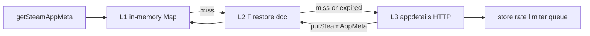

# Steam App Meta Cache

**Last updated:** 2026-06-03

**Related:** [Steam sync & data](./steam-sync-and-data.md) (orchestrator, cadence, rate limiter) · [Maintenance](./maintenance-and-errors.md) · [OPS](../OPS.md)

## Purpose

Wishlist sync and other flows need lightweight Steam store metadata — game name, store `type`, and co-op category flags — without re-scraping the full appdetails payload on every run.

`functions/steamAppMetaCache.js` provides a **Firestore L2 cache** with an in-memory **L1** layer (same Cloud Function invocation) and HTTP **L3** fallback. Store HTTP goes through the shared **serial store rate limiter** (`functions/steamRateLimiter.js`).

## Firestore path

```
artifacts/{appId}/public/data/steam-app-meta/{steamAppId}
```

Path helper: `steamAppMetaCollectionPath(appId)` in `functions/lib/firestorePaths.js`.

Segment count is **even** (collection under `public/data`).

## Document schema

| Field | Type | Description |
| :--- | :--- | :--- |
| `appId` | number | Steam app ID |
| `name` | string \| null | Store display name |
| `storeType` | string \| null | Steam `data.type` (e.g. `game`, `dlc`, `demo`) |
| `hasCoop` | boolean | Co-op from category IDs 9, 38, 39, 48 |
| `fetchedAt` | number | Epoch ms when L3 fetch occurred |
| `expiresAt` | number | `fetchedAt + 180 days` |
| `updatedAt` | timestamp | Server timestamp on write |

**TTL:** 180 days. Expired docs are deleted by the weekly `cachePurge` orchestrator task.

## Layering (L1 → L2 → L3)



1. **L1** — `Map` keyed by `{appId}:{steamAppId}` for the current invocation only.
2. **L2** — Firestore read; valid when `expiresAt > now`.
3. **L3** — `fetchAppDetailsForMeta(steamAppId)` in `functions/steam.js` (rate-limited appdetails).

`getSteamAppMeta` returns `{ cacheHit, cacheMiss }` alongside meta fields when useful for stats.

## API

| Function | Purpose |
| :--- | :--- |
| `getSteamAppMeta(db, appId, steamAppId, { forceRefresh? })` | Read through L1 → L2 → L3 |
| `putSteamAppMeta(db, appId, steamAppId, meta)` | Write L2 + refresh L1 |
| `purgeExpiredAppMeta(db, appId)` | Delete docs with `expiresAt < now`; returns `{ deleted }` |

## Rate limiter interaction

All `store.steampowered.com` requests (appdetails, appreviews) share one **serial queue** with a **400ms** minimum gap (`scheduleStoreRequest` in `functions/steamRateLimiter.js`).

Wishlist sync no longer sleeps 300ms between candidates — the limiter paces store calls globally across library sync, wishlist cache misses, and manual scrapes in the same process.

Steam Web API calls (`api.steampowered.com`) use a separate concurrent pool (`scheduleSteamWebApiRequest`).

## Wishlist incremental flow

Callable **`syncSteamWishlists`** (`functions/steamWishlistSync.js`):

1. Fetch wishlist app IDs via Steam Web API (`getWishlist`) — 2 bulk calls for both users.
2. Diff against Firestore game doc IDs → candidate list.
3. For each candidate, **`getSteamAppMeta`** (cache-first).
4. **Filter:** `hasCoop === true` **and** `storeType === 'game'` (skip DLC, demos, videos, etc.).
5. Write results to `config/steam-wishlist-candidates` with stats.

Stats written to the config doc:

| Field | Meaning |
| :--- | :--- |
| `cacheHits` | Served from L1 or valid L2 |
| `cacheMisses` | Required L3 HTTP fetch |
| `dlcSkipped` | `storeType === 'dlc'` |
| `nonGameSkipped` | Other non-`game` types |
| `nonCoopSkipped` | Games without co-op categories |
| `scrapeFailed` | L3 returned no data |

After warm-up (~90% cache hit rate typical), daily wishlist runs need **0–5 store calls/day** instead of one per candidate.

## Scheduled vs manual wishlist

| Trigger | `autoImport` | Behavior |
| :--- | :---: | :--- |
| Orchestrator `steamWishlist` (24h) | `true` | Filter co-op games → auto-import via `enrichAndPersistFromSteam` |
| Callable `syncSteamWishlists` (Maintenance) | `false` | Candidates list only — user adds via Maintenance UI |

See [Unified scheduler orchestrator](./steam-sync-and-data.md#unified-scheduler-orchestrator) for task registry and state doc.

## Purge policy

Orchestrator task **`cachePurge`** (`functions/scheduler/tasks.js`) runs every **7 days** and calls `purgeExpiredAppMeta(db, appId)`.

Only documents past `expiresAt` are removed; active entries are retained for the full 180-day window.

## Firestore rules

`firestore.rules` — authenticated allowlist users may **read** `steam-app-meta` docs; **write: false** (server/Admin SDK only), matching the `config/` pattern.

## What is NOT cached here

These stay on game documents with existing staleness gates in `steamSync.js`:

- Price / sale state (`steamDynamic`)
- Review counts and scores
- Current / average player counts (`steamStats`)
- Full static scrape (screenshots, developers, HLTB, ITAD, etc.)

The app-meta cache holds only the minimal fields needed for wishlist filtering and name display.

## Primary code

| File | Role |
| :--- | :--- |
| `functions/steamAppMetaCache.js` | L1/L2 cache, purge |
| `functions/steam.js` | `fetchAppDetailsForMeta`, rate-limited store HTTP |
| `functions/steamRateLimiter.js` | Serial store queue |
| `functions/steamWishlistSync.js` | Wishlist consumer |
| `functions/scheduler/tasks.js` | `cachePurge` task |
| `functions/lib/firestorePaths.js` | Path helper |
