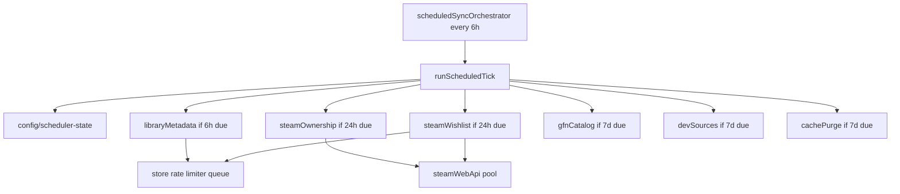

# Steam Sync & Third-Party Data

**Last updated:** 2026-06-03

**Spec:** [`manifest_of_understanding.md`](../manifest_of_understanding.md) § F5, F6  
**Related:** [Maintenance](./maintenance-and-errors.md) · [Bulk import](./bulk-import.md) · [Steam app meta cache](./steam-app-meta-cache.md) · [OPS](../OPS.md)

## Schema v2 (nested)

Game documents use nested `steamStatic`, `steamDynamic`, and `steamStats`. Per-metric sync cadence is enforced inside the `libraryMetadata` orchestrator task — see [Sync cadence](#sync-cadence).

Store region: **`cc=ua`** (UAH, English). All Steam HTTP in Cloud Functions (`functions/steam.js`, `steamCache.js`). Store and Web API requests are paced by `functions/steamRateLimiter.js` — see [Rate limiter pools](#rate-limiter-pools) below.

Wishlist co-op filtering uses the Firestore **app-meta cache** — see [Steam app meta cache](./steam-app-meta-cache.md) for schema, TTL, and cache-hit stats.

## Unified scheduler orchestrator

A **single** Cloud Scheduler job drives all periodic sync work. Entry point: **`scheduledSyncOrchestrator`** (`functions/schedulerOrchestrator.js`) → `runScheduledTick` every **6 hours**.

Per-task due checks use `config/scheduler-state` (`functions/lib/firestorePaths.js` → `schedulerStateDocPath`). Each task tracks `lastRunAt` / `lastCompleteAt`; a task runs only when its interval has elapsed since `lastCompleteAt`.

Due tasks run in parallel via `Promise.allSettled`; all `store.steampowered.com` HTTP still serializes through the shared rate limiter.

**Replaces** the former three separate schedulers (`syncLibrarySteam`, `syncGfnCatalogScheduled`, `syncDevSourcesScheduled`). Manual Maintenance callables invoke the same `*Core` functions directly (bypass due checks).

| Task id | Interval | Core | Notes |
| :--- | :--- | :--- | :--- |
| `libraryMetadata` | 6h | `syncLibrarySteamCore` | Per-game staleness gates inside |
| `steamOwnership` | 24h | `syncSteamOwnershipCore` | One-way merge — see below |
| `steamWishlist` | 24h | `syncSteamWishlistsCore` | `{ autoImport: true }` — co-op games auto-added |
| `gfnCatalog` | 7d | `syncGfnCatalogToFirestore` | |
| `devSources` | 7d | `syncDevSourcesToFirestore` | Incremental curator resume |
| `cachePurge` | 7d | `purgeExpiredAppMeta` | Deletes expired app-meta docs |

## Sync cadence

### Orchestrator task intervals

| Task | Schedule | What runs |
| :--- | :--- | :--- |
| Library metadata | Every **6h** (orchestrator tick) | Gated per-game sync — see per-metric table |
| Steam ownership | Every **24h** | One-way `owned.user0/user1` merge from Web API |
| Steam wishlist | Every **24h** | Co-op filter + **auto-import** new games |
| GFN catalog | Every **7d** | GraphQL → `config/gfn-catalog` |
| Dev sources | Every **7d** | NE GRAI + curator lists |
| App-meta purge | Every **7d** | Delete expired `steam-app-meta` docs |

### Per-metric gates (inside `libraryMetadata` / `syncLibrarySteamCore`)

| Object | Cadence (non-banned) |
| :--- | :--- |
| `steamStatic` | Daily (TBA/EA); weekly (released) |
| `steamDynamic` | Daily (active); weekly (`finished`) |
| `steamStats` | Player sample each 6h run; **omitted for TBA** |
| HLTB | Weekly |
| ITAD | Daily (active); weekly (`finished`) |

### Price piggyback (no extra HTTP)

When static metadata is due but dynamic is not, `syncOneGameSteamMetadata` still fetches appdetails once and **merges price fields** into `steamDynamic` via `mapPriceData()` — a free weekly price refresh for finished games that would otherwise skip dynamic sync.

When static **and** dynamic are both due on the same tick, a **single** appdetails fetch serves both mappers (no duplicate store call).

## Rate limiter pools

`functions/steamRateLimiter.js` — all schedulers and manual callables share these pools:

| Pool | Host | Concurrency | Min gap | Used by |
| :--- | :--- | :--- | :--- | :--- |
| `store` | `store.steampowered.com` | **1** (serial queue) | **400ms** | appdetails, appreviews, library sync, wishlist cache miss, dev index |
| `steamWebApi` | `api.steampowered.com` | **3** parallel | **300ms** | ownership, wishlist ID list |
| `thirdParty` | HLTB, ITAD, GFN GraphQL | parallel OK | existing delays | enrich, catalog, dev curators |

Naive parallel store scraping across tasks would burst past Steam's ~200 req / 5 min IP limit; the serial store queue prevents 429s even when orchestrator tasks run concurrently.

## Callables & schedules

| Export | Type | Purpose |
| :--- | :--- | :--- |
| `previewSteamGame` | Callable | Scrape-only preview for add flow (no write) |
| `addGameFromSteam` | Callable | Scrape + write + HLTB/ITAD enrich + RU vet |
| `syncSteamLibrary` | Callable | Manual full sync ("Load meta info") |
| `refreshGameFromSteam` | Callable | Manual single-game re-scrape (GameEditModal) |
| `syncGfnCatalog` | Callable | GFN GraphQL → `config/gfn-catalog` |
| `syncSteamOwnership` | Callable | One-way ownership merge from Steam Web API |
| `syncSteamWishlists` | Callable | Pull wishlists → co-op candidates (no auto-import) |
| `syncDevSources` | Callable | Manual dev source refresh |
| `scheduledSyncOrchestrator` | Scheduled | Every **6 hours** — runs all due orchestrator tasks |

Client: `src/services/cloudFunctions.js` — metadata/GFN/dev sync callables use **540s** timeout; `syncSteamOwnership` and `refreshGameFromSteam` use **120s**; `syncSteamWishlists` uses **540s** (co-op filter may hit store on cache miss).

## Third-party

| Service | Writes to | Requires |
| :--- | :--- | :--- |
| HLTB | `steamStatic.hltb` (playtime data only) | Unofficial API (fragile) |
| ITAD | `steamDynamic` critics, historical low | `ITAD_API_KEY` |
| GFN | `config/gfn-catalog.steamAppIds` | `GFN_VPC_ID` (default Warsaw) |

HLTB/ITAD failures are recorded in `config/maintenance-errors`, not on game documents.

## GFN badge

UI checks **global catalog** at render time — not per-game `geforceNowReady` field alone.

## Cost / scale

~700 writes/day @ 147 games. Single Cloud Scheduler job (was 3). Daily wishlist with ~90% app-meta cache hits adds negligible store traffic. Timeout risk grows ~400–500 games — may need batching (see [M5](../CODE_IMPROVEMENTS.md)).

## Steam Web API foundation (implemented)

Low-level client in `functions/steamWebApi.js` — used by ownership and wishlist sync callables.

| Function | Steam endpoint | Returns |
| :--- | :--- | :--- |
| `getOwnedGames(steamId)` | `IPlayerService/GetOwnedGames/v1` | `{ appIds: number[], error }` |
| `getWishlist(steamId)` | `IWishlistService/GetWishlist/v1` | `{ appIds: number[], error }` |
| `getConfiguredSteamIds()` | — | `{ user0, user1 }` from env |

**Env (functions only — see [`OPS.md`](../OPS.md)):**

| Variable | Purpose |
| :--- | :--- |
| `STEAM_WEB_API_KEY` | Plain 32-char hex key from [Steam Web API key registration](https://steamcommunity.com/dev/apikey) — e.g. `C1F410E37C14EC0A…` (not a URL) |
| `STEAM_ID_0`, `STEAM_ID_1` | 64-bit Steam IDs for User 0 / User 1 |

**Requirements:** Each Steam profile must be **public** and **game details** must be visible — private profiles return structured errors, not app ID lists.

Calls go through `scheduleSteamWebApiRequest` (concurrent pool, 300ms gap) in `functions/steamRateLimiter.js`.

Errors use structured `{ appIds: null, error: '...' }` — missing key, invalid Steam ID, HTTP failure, or private profile.

## Steam library sync (ownership) — implemented

Callable **`syncSteamOwnership`** and orchestrator task **`steamOwnership`** (24h) merge `owned.user0` / `owned.user1` from each user's Steam **owned games** list (`getOwnedGames`). Distinct from the 6h **metadata** sync (`libraryMetadata` / `syncSteamLibrary`).

**One-way merge:** if Steam reports owned and Firestore is `false` → set `true`. Never clears `true` → `false` (manual toggle in UI remains authoritative for removals).

| Write target | Fields |
| :--- | :--- |
| Game docs | `owned.user0`, `owned.user1` (only `false` → `true` transitions) |
| `config/steam-ownership-sync` | `syncedAt`, `user0OwnedCount`, `user1OwnedCount`, `gamesUpdated`, `gamesChecked`, `errors` |
| `config/maintenance-audit` | `steamOwnership` snapshot for Maintenance UI |
| `config/maintenance-errors` | API / per-game update failures (`source: steam-ownership`) |

Partial sync when only one user's library is available — that user's flags are updated; the other user's set is skipped.

Maintenance UI: **Sync Steam ownership** button (`MaintenanceModal.jsx`).

## Steam wishlist sync — implemented

Callable **`syncSteamWishlists`** and orchestrator task **`steamWishlist`** (24h) pull each user's public Steam wishlist via `getWishlist`, compare against Firestore game doc IDs, and filter **co-op game candidates** (`storeType === 'game'`, co-op category IDs 9/38/39/48) not yet in the library. Each candidate is enriched via **`getSteamAppMeta`** ([Firestore app-meta cache](./steam-app-meta-cache.md) with HTTP fallback).

| Mode | `autoImport` | Behavior |
| :--- | :---: | :--- |
| Maintenance callable | `false` | Candidates list only — per-row **Add** in UI |
| Scheduled orchestrator | `true` | Auto-import co-op candidates via `enrichAndPersistFromSteam` |

| Write target | Fields |
| :--- | :--- |
| `config/steam-wishlist-candidates` | `syncedAt`, `candidates[]`, `user0WishlistCount`, `user1WishlistCount`, `preFilterCandidateCount`, `nonCoopSkipped`, `dlcSkipped`, `nonGameSkipped`, `cacheHits`, `cacheMisses`, `scrapeFailed`, `candidateCount`, `importedCount`, `importErrors`, `errors` |
| `config/maintenance-audit` | `steamWishlist` snapshot for Maintenance UI |
| `config/maintenance-errors` | API / import failures (`source: steam-wishlist`) |

Each candidate: `{ appId, name, onWishlistUser0, onWishlistUser1 }`. After warm-up, ~90% cache hit rate → **0–5 store calls/day** typical for daily wishlist runs.

Maintenance UI: **Sync Steam wishlists** button + co-op candidate list (game name links to Steam store) with per-row **Add** (reuses `previewSteamGame` → `addGameFromSteam`). Duplicate guard if a game was added since the last sync.

## See also

- [Steam app meta cache](./steam-app-meta-cache.md) — wishlist co-op filter L2 cache
- [RU vetting](./ru-developer-vetting.md) — runs on add after scrape
- [Lifecycle](./lifecycle-and-ownership.md) — banned skip, finished throttle
- [UI shell](./ui-shell-and-modals.md) — two-phase add via `previewSteamGame`
