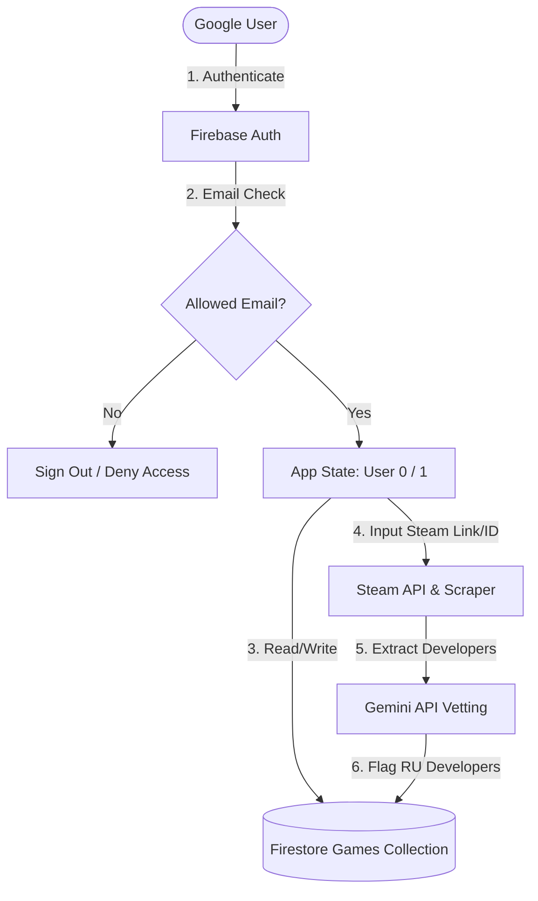
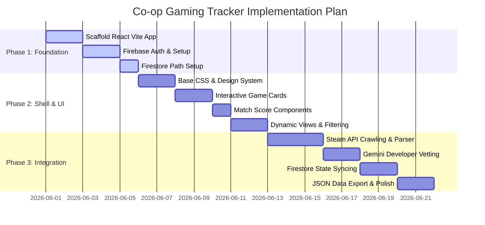

# Manifest of Understanding: Co-op Gaming Tracker

This document serves as the **single source of truth** and **system context prompt** for scaffolding, developing, and deploying the **Co-op Gaming Tracker** application. It is designed to be read directly by AI coding assistants (e.g., Cursor, Windsurf, PearAI) and developers to ensure perfect alignment with system constraints, schemas, and architectural patterns.

---

## 1. System Architecture & Tech Stack

The application is architected as a lightweight, reactive, single-page application (SPA) optimized for fast load times, aesthetic excellence, and zero-cost hosting serverless infrastructure.

| Component | Technology | Description |
| :--- | :--- | :--- |
| **Frontend Framework** | React (Vite Template) | Fast HMR, component-driven, modern JavaScript/TypeScript ecosystem. |
| **Styling Engine** | Tailwind CSS / Vanilla CSS | Responsive design, modern layouts, micro-animations, glassmorphism UI. |
| **Database** | Firebase Firestore | Real-time synchronization, document-oriented flexible schema. |
| **Authentication** | Firebase Auth | Secure Google Sign-In only; mapped to strict allowed user indexes. |
| **Hosting Platform** | Firebase Hosting | Free tier SSL-enabled static asset edge hosting. |
| **AI Integration** | Gemini API (`gemini-2.5-flash`) | Asynchronous, automated vetting for developer screening. |
| **Backend API** | Firebase Cloud Functions | Steam scrape, Gemini vetting, scheduled refreshes — `europe-west1`. Client does not call Steam directly. |



---

## 2. User & Database Agnosticism (Core Contract)

> [!IMPORTANT]
> **Strict Anti-Hardcoding Directive**
> Under no circumstances must any personal names, static email labels, or static "Me/Friend" identifiers be hardcoded in the codebase, database fields, or configuration. The system operates on a dual-user abstract design: **User 0** and **User 1**.

### User Mapping Logic

1. The application configuration contains an array of exactly two allowed email addresses:
   ```javascript
   const ALLOWED_EMAILS = ["user0_email@gmail.com", "user1_email@gmail.com"];
   ```
2. Upon Google Sign-In, the system evaluates the authenticated user's email:
   * **If** `email === ALLOWED_EMAILS[0]`: Active session is designated **User 0** (`userIndex = 0`).
   * **If** `email === ALLOWED_EMAILS[1]`: Active session is designated **User 1** (`userIndex = 1`).
   * **Else**: The session is immediately rejected, signed out, and denied Firestore access.

### Dynamic UI Presentation
The user interface must resolve display labels dynamically:
* Use the current user's Google Display Name or custom Steam Nickname dynamically fetched from their profile configuration.
* Avoid labels like "My Hype" or "My Friend's Owned". Instead, resolve the target identity:
  * For the active user: Display their resolved nickname/name + `(You)`.
  * For the other user: Display the other user's resolved nickname/name.

---

## 3. Database Schema (Firestore Collections)

The database structure is designed to keep static app configurations decoupled from the games directory. Paths are relative to the root collection path:

### Configuration & Static Data Path
* **Path:** `/artifacts/{appId}/public/data/config/default` (singleton document id `default`)
* **Purpose:** Stores application global configs (e.g. `gfnCatalog`), user nicknames, and global metadata.

### Games Collection Path
* **Path:** `/artifacts/{appId}/public/data/games`
* **Purpose:** Stores the individual documents of the tracked games library.

---

### Game Document Schema (`/games/{gameId}`)

```json
{
  "id": "steam_app_id_or_uuid",
  "name": "Game Title",
  "price": "1 199₴",
  "originalPrice": "1 199₴",
  "currency": "UAH",
  "isOnSale": false,
  "discountPercent": 0,
  "thumbnail": "https://shared.akamai.steamstatic.com/store_item_assets/steam/apps/APP_ID/header.jpg",
  "url": "https://store.steampowered.com/app/APP_ID/",
  "developers": ["Developer Name"],
  "ruDeveloperAlert": false,
  "ruDeveloperExplanation": "Brief reason explaining Russian developer ties (if applicable)",
  "developmentStatus": "released", 
  "currentVersion": "v1.4.2", 
  "owned": {
    "user0": false,
    "user1": false
  },
  "userNotes": {
    "user0": "",
    "user1": ""
  },
  "hypeTier": {
    "user0": "morkite_found",
    "user1": "morkite_found"
  },
  "steamOverview": "Short Steam store description shown on the card.",
  "steamReviewPercent": 94,
  "libraryState": "active",
  "finishedRating": null,
  "stateMeta": {
    "versionAtEntry": "v1.4.2",
    "enteredAt": "Firestore Timestamp",
    "note": ""
  },
  "hasUpdateSinceState": false,
  "lastVersionCheck": "Firestore Timestamp",
  "steamTags": ["Action", "Co-op", "Early Access"],
  "geforceNowReady": false,
  "playerCount": 12432,
  "screenshots": [
    "https://shared.akamai.steamstatic.com/store_item_assets/steam/apps/APP_ID/ss_1.jpg",
    "https://shared.akamai.steamstatic.com/store_item_assets/steam/apps/APP_ID/ss_2.jpg"
  ],
  "coopSpecs": {
    "onlineCoop": true,
    "splitScreen": false,
    "crossPlay": false,
    "maxPlayers": 4
  }
}
```

#### Field Glossary & Specifications
* **`id`**: Steam App ID (as a string) or a randomly generated UUID if added manually.
* **`developmentStatus`**: Enum restricted to `released` | `early_access` | `tba`.
* **`currentVersion`**: Semantic version string (e.g. `v1.0.2`, `v0.8.4-beta`) or `null`/empty string for `tba`.
* **`owned`**: Map tracking dynamic ownership for User 0 and User 1.
* **`userNotes`**: Optional per-user free-text notes (`user0`, `user1`) shown on the card — separate from lifecycle `stateMeta.note`.
* **`hypeTier`**: Per-user personal hype tier: `worthless_crystal` | `morkite_found` | `we_rich` (default `morkite_found`). Each tier applies a multiplier to a shared base of `5` for that user's contribution to Total Hype.
* **`steamOverview`**: Short description from Steam (`short_description`) displayed on the game card.
* **`steamReviewPercent`**: Steam positive review percentage (`0`–`100`), used as a minor factor in Total Hype (less impact than `developmentStatus`).
* **`libraryState`**: Primary lifecycle enum — `active` | `replayable` | `waiting_for_updates` | `finished` | `banned`. Replaces legacy `finished`, `abandoned`, and custom user `tags`.
* **`finishedRating`**: Optional `null | 1 | 2 | 3 | 4 | 5` — meaningful when `libraryState === 'finished'`; cleared to `null` when leaving Finished. Shown on cards and editable in the lifecycle/edit modals.
* **`stateMeta`**: Snapshot when entering (or re-entering) a lifecycle state. `versionAtEntry` copies `currentVersion` at that moment; `enteredAt` is a timestamp; `note` is optional text (encouraged for `banned`). Re-assigning the **same** state refreshes the snapshot and clears update alerts ("mute").
* **`hasUpdateSinceState`**: Set by scheduled refresh when Steam `currentVersion` differs from `stateMeta.versionAtEntry`. Drives an update badge on the card — no news feed UI.
* **`lastVersionCheck`**: Timestamp of last background version check; `finished` games checked ~weekly, others daily.
* **`steamTags`**: Steam genres/categories (from scrape) — used for **search/filter only**, not lifecycle management.
* **`geforceNowReady`**: Boolean — true when the game is verified available on GeForce NOW.

**Legacy fields** (`finished`, `abandoned`, `tags`): no longer written. Read fallback maps `abandoned` → `banned`, `finished` → `finished`, else `active`.

---

## 4. Feature Specifications

### F1: Access & Security Rules
* **Authentication Lockout**: Any attempt to sign in with an email not present in `ALLOWED_EMAILS` is rejected instantly.
* **Firestore Security Rules**: The firestore rules must strictly mirror this validation:
  ```javascript
  rules_version = '2';
  service cloud.firestore {
    match /databases/{database}/documents {
      match /artifacts/{appId}/public/data/games/{gameId} {
        allow read, write: if request.auth != null && 
          (request.auth.token.email == 'user0_email@gmail.com' || 
           request.auth.token.email == 'user1_email@gmail.com');
      }
    }
  }
  ```

### F2: Library Views, Lifecycle & Search

#### Sidebar lifecycle tabs (primary navigation)
Each tab filters by `libraryState`:

| Tab | Filter |
| :--- | :--- |
| **Active** | `libraryState === 'active'` |
| **Replayable** | `libraryState === 'replayable'` |
| **Waiting for updates** | `libraryState === 'waiting_for_updates'` |
| **Finished** | `libraryState === 'finished'` |
| **Banned** | `libraryState === 'banned'` |

Lifecycle is changed via a **modal** on the game card (all states visible, optional note). Re-selecting the current state re-baselines `stateMeta` and clears `hasUpdateSinceState`.

#### Search & secondary filters (dashboard toolbar)
Within the active sidebar tab, users can search/filter by:
* Game **name** (text)
* **Steam tags** (`steamTags` from scrape)
* **Development status** (`released` / `early_access` / `tba`)
* **Ownership** (neither / one / both own) — optional chips
* **On sale** — secondary filter (`isOnSale`), not a lifecycle tab

**Deferred:** "Ready to Play" preset filter (both own + active lifecycle). Archive passcode for Banned tab.

#### Update notifications (no news feed)
Scheduled Cloud Function compares Steam `currentVersion` to `stateMeta.versionAtEntry`. When they differ, set `hasUpdateSinceState = true` and show a badge on the card. User mutes by re-assigning the same lifecycle state.

---

### F3: Total Hype Algorithm (Match Ring)

**Total Hype** is the single desirability number shown on the card's radial ring (no `%` suffix). It combines every factor below. Each user's personal tier only affects their portion of the tier base—ownership, release status, and Steam reviews apply to the combined result.

$$\text{Total Hype} = \text{TierBase} \times \text{OwnershipFactor} \times \text{StatusFactor} \times \text{SteamOverviewFactor}$$

All factors are rounded to an integer for display (`0`–`100` scale on the ring).

#### Parameter Breakdown

##### 1. Personal tier contributions (partial per-user influence)
Each user selects one tier per game (Deep Rock Galactic themed labels in UI):

| `hypeTier` value | UI label | Multiplier on base `5` |
| :--- | :--- | :--- |
| `worthless_crystal` | Worthless Crystal | `0.5` → effective `2.5` |
| `morkite_found` | Morkite Found | `1.0` → effective `5` |
| `we_rich` | We're Rich! | `1.5` → effective `7.5` |

$$\text{TierBase} = \frac{\text{effective}(user0) + \text{effective}(user1)}{15} \times 100$$

Maximum pair sum is `15` (both users at We're Rich!).

##### 2. OwnershipFactor
* **`1.0`** — both own (`owned.user0 && owned.user1`)
* **`0.5`** — exactly one owns
* **`0.25`** — neither owns

##### 3. StatusFactor (Development State) — **high impact**
* **`1.0`** — `released`
* **`0.75`** — `early_access`
* **`0.10`** — `tba`

##### 4. SteamOverviewFactor — **low impact** (secondary to status)
Derived from `steamReviewPercent` when present:

$$\text{SteamOverviewFactor} = 0.9 + \left(\frac{\text{steamReviewPercent}}{100}\right) \times 0.15$$

Range approximately `0.90` (0% reviews) to `1.05` (100% positive). Defaults to **`1.0`** if review data is missing.

##### 5. Library sort order
Games sort **descending by Total Hype** (highest first).

##### 6. Hover breakdown (required UX)
Hovering the Total Hype ring shows how the number was built: each user's nickname, tier label, personal effective value, then multipliers for ownership, status, and Steam reviews, then the final Total Hype.

> [!WARNING]
> **Total Hype overrides (non-negotiable)**
> Total Hype is **forced to `0`** (tier picker disabled) when any of:
> * `ruDeveloperAlert === true` — red neon border
> * `libraryState === 'finished'`
> * `libraryState === 'banned'`

---

### F4: Automated Russian Developer Screening

This feature ensures local developer transparency. When a game is added to the system, an asynchronous background check is executed via the Gemini API.

#### Prompt Template & Response Mapping
* **Model:** `gemini-2.5-flash`
* **System Directive**: The AI must respond strictly with a valid JSON object structure. Do not wrap in markdown triple backticks.
* **Prompt Structure**:
  ```text
  Check if the game development studio '{developerName}' has Russian founders, Russian offices, Russian origin, or is a Russian-founded entity now registered in another country (such as Cyprus, UAE, or Armenia) to bypass scrutiny. Reply with a JSON object: {"isRussianRelated": true/false, "explanation": "Brief reason why"}. Do not return markdown.
  ```

#### UI Representation
* **Warning Card Overlay**: If `isRussianRelated` returns `true`, set `ruDeveloperAlert = true` and `ruDeveloperExplanation = explanation`.
* **Visual Treatment**: The game card must render a distinct red neon border (`box-shadow: 0 0 10px rgba(239, 68, 68, 0.7)`), and display an alert warning icon in the card details overlay showing the explanation text.

---

### F5: Steam API Integration & Crawling

Games can be added by inputting either a full Steam URL (e.g., `https://store.steampowered.com/app/105600/Terraria/`) or the raw App ID (e.g., `105600`).

#### 1. Parsing User Input
Parse the App ID using regex:
```javascript
const parseAppId = (input) => {
  const match = input.match(/\/app\/(\d+)/);
  return match ? match[1] : input.trim();
};
```

#### 2. Crawling Strategy (Cloud Functions)
All Steam HTTP calls run server-side in Cloud Functions (`functions/steam.js`). Responses must be **cached** (in-memory or Firestore cache collection with TTL) to respect rate limits and reduce Blaze cost. The client calls `addGameFromSteam` and scheduled refresh functions only.

**Duplicate guard:** `addGameFromSteam` must reject (or return a clear error) if a document with the same Steam App ID already exists.

#### 3. Field Extractor Mapping
Extract details from the API response payload (`data[appId].data`):

* **`name`** $\rightarrow$ `name`
* **`price`** $\rightarrow$ `price_overview.final_formatted` from Steam with `cc=ua` (UAH, English labels) || `Free to Play`
* **`originalPrice`** $\rightarrow$ `price_overview.initial_formatted` (UA store, UAH) || `Free to Play`
* **`currency`** $\rightarrow$ always `UAH` for scraped games
* **`isOnSale`** $\rightarrow$ `price_overview.discount_percent > 0`
* **`thumbnail`** $\rightarrow$ `header_image` (e.g. `https://shared.akamai.steamstatic.com/store_item_assets/steam/apps/{appId}/header.jpg`)
* **`developers`** $\rightarrow$ `developers` (Triggers AI Russian screening)
* **`steamOverview`** $\rightarrow$ `short_description`
* **`steamReviewPercent`** $\rightarrow$ positive review % from Steam review summary when available (else omit → factor `1.0`)
* **`screenshots`** $\rightarrow$ `screenshots.slice(0, 5).map(s => s.path_full)`
* **`developmentStatus`** $\rightarrow$ Evaluate categories and genres.
  * If `genres` contains ID `70` (Early Access) $\rightarrow$ `"early_access"`
  * If `release_date.coming_soon` is `true` $\rightarrow$ `"tba"`
  * Else $\rightarrow$ `"released"`
* **`currentVersion`** $\rightarrow$ Derived by hitting the Steam App news feed API:
  `https://api.steampowered.com/ISteamNews/GetNewsForApp/v2/?appid={appId}&count=3`
  Parse headings for semantic version patterns (e.g. `v1.2.3`, `Update 4`). If none found, fallback to `"v1.0.0"` (or null if "tba").
* **`coopSpecs`** $\rightarrow$ Parse `categories` for specific cooperative IDs:
  * **Online Co-op** $\rightarrow$ Presence of ID `38`
  * **Split Screen** $\rightarrow$ Presence of ID `39` (Shared/Split Screen)
  * **Cross-Play** $\rightarrow$ Presence of ID `48` (Cross-Platform Multiplayer)
  * **Max Players** $\rightarrow$ Scraped or fallback defaults based on genre (default `4`).
* **`steamTags`** $\rightarrow$ `genres[].description` and relevant `categories[].description` (lowercase), for search/filter.
* **`geforceNowReady`** $\rightarrow$ Verify against NVIDIA GeForce NOW catalog/API for the Steam App ID; store boolean, show badge on card when true.
* **`libraryState`** $\rightarrow$ Default `"active"` on import; set `stateMeta.versionAtEntry` to scraped `currentVersion`.

---

### F6: Card display rules

* **Price hidden** when both users own the game (`owned.user0 && owned.user1`).
* **GeForce NOW badge** when `geforceNowReady === true`.
* **SteamDB link** — `https://steamdb.info/app/{appId}/` in card actions.
* **Owned indicator** — three distinct icons (not circles): backpack / crystal / crossed pickaxes with gray → amber → green.

---

## 5. UI & UX Aesthetics (Premium Directive)

The dashboard should feel like a premium, sleek gaming platform (similar to Steam Deck UI or modern launchers).

* **Color Palette**: Sleek obsidian dark mode (`#0B0F19`), neon mint accent for match scores, crimson red for RU alerts, and vibrant blue for interactive elements.
* **Aero Glassmorphism**: Cards use translucent backdrop filters (`backdrop-filter: blur(12px) bg-opacity-40`).
* **Total Hype ring**: Bottom-right on the card thumbnail; shows the Total Hype integer **without a `%` symbol**. Color scales red → yellow → mint by score. Click opens a small tier picker for the **active user only**. Hover shows the full score breakdown tooltip.
* **Owned indicator**: Bottom-left on the thumbnail; three distinct icons (backpack / crystal / pickaxes). Click toggles ownership for the active user. Hover tooltip lists each nickname and owned state.
* **Price**: Hidden when both users own the game.
* **GeForce NOW**: Small badge/icon when `geforceNowReady`.
* **Lifecycle badge**: Opens lifecycle modal; update pulse badge when `hasUpdateSinceState`.
* **Steam overview**: Truncated `steamOverview` text in the card body (from Steam `short_description` when scraped).
* **Development status**: Color-coded — green (`released`), yellow (`early_access`), red (`tba`).
* **Screenshots**: Dedicated button opens a modal carousel (not hover-on-card).
* **Identity labels**: Resolved from `VITE_USER0_NICKNAME` / `VITE_USER1_NICKNAME` in `.env` — never "Me", "Friend", or hardcoded names. Active user suffix: `(You)`.
* **Actionable Badges**: Visual indicators showing Co-op specs (e.g. `Online 4-Player`, `Crossplay Ready`) at a glance.

---

## 6. Detailed Step-by-Step Implementation Roadmap



### Phase 1: Setup & Scaffolding
* Initialize the React + Vite template in the target workspace directory.
* Set up standard configuration hooks inside a centralized context provider (`AuthContext`).
* Write the `onAuthStateChanged` auth listener. Validate standard user index mappings (User 0 / User 1) using the `ALLOWED_EMAILS` config.
* Build the login gate view. Block unauthenticated access completely.

### Phase 2: Design System & Mock Shell
* Create a dedicated `/src/index.css` file housing custom HSL utility variables, glassy animation rules, and smooth scaling card transitions.
* Develop mock state files to pre-render the system. Validate the correct mathematical computation of the Match Score formula.
* Construct the Filter Sidebar and Dashboard view grid. Ensure responsiveness on mobile formats.
* Create a simple local mock database bypass toggle for offline testing.

### Phase 3: APIs & Real-time Integration
* Program the Steam parser service using the CORS proxy pipeline.
* Integrate the Gemini API connection string, creating safe prompt sanitizers to prevent injection attacks or format breakage.
* Hook up interactive state buttons (e.g. "Toggle Owned", "Update Hype Slider") to write directly to Firestore using dynamic path references `/games/{gameId}` updated under `owned.userX` (where X is the active session index).
* Integrate client-side JSON serialization to export database tables dynamically.
