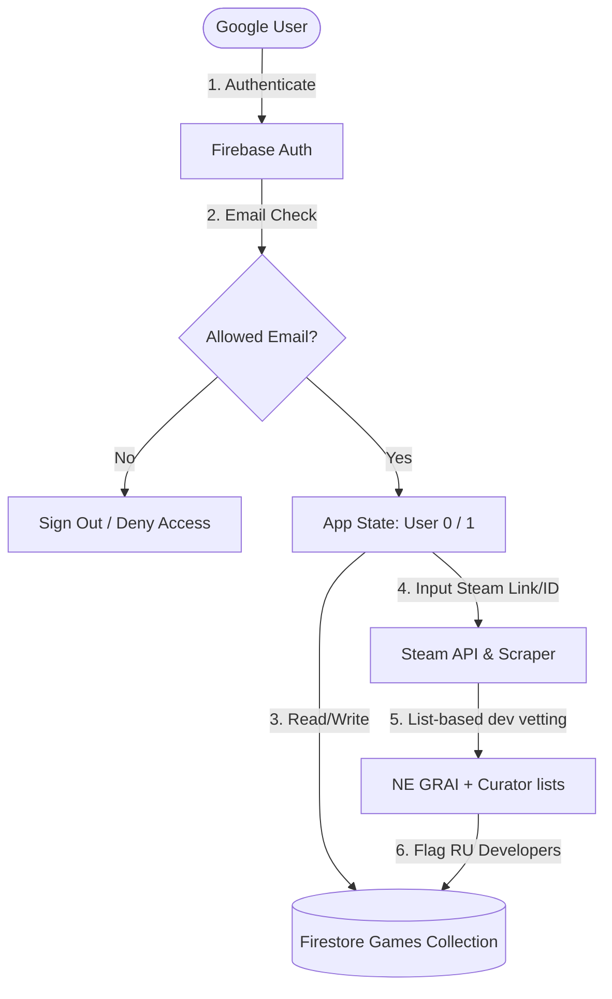

# Manifest of Understanding: Co-op Gaming Tracker

This document serves as the **single source of truth** and **system context prompt** for scaffolding, developing, and deploying the **Nen?** co-op gaming tracker. It is designed to be read directly by AI coding assistants and developers to ensure alignment with system constraints, schemas, and architectural patterns.

> **Agent onboarding, checklist, and ops:** see [`docs/AGENT_INTRO.md`](./AGENT_INTRO.md), [`docs/FEATURE_CHECKLIST.md`](./FEATURE_CHECKLIST.md), [`docs/OPS.md`](./OPS.md).

---

## 1. System Architecture & Tech Stack

The application is architected as a lightweight, reactive, single-page application (SPA) optimized for fast load times, aesthetic excellence, and zero-cost hosting serverless infrastructure.

| Component | Technology | Description |
| :--- | :--- | :--- |
| **Frontend Framework** | React (Vite Template) | Fast HMR, component-driven, modern JavaScript/TypeScript ecosystem. |
| **Styling Engine** | Tailwind CSS / Vanilla CSS | Responsive design, modern layouts, micro-animations, glassmorphism UI. |
| **Database** | Firebase Firestore | Real-time synchronization, document-oriented flexible schema. |
| **Authentication** | Firebase Auth | Secure Google Sign-In only; mapped to strict allowed user indexes. |
| **Hosting Platform** | Firebase Hosting | Free tier SSL-enabled static asset edge hosting. |
| **Backend API** | Firebase Cloud Functions | Steam scrape, list-based RU vetting, scheduled refreshes — `europe-west1`. Client does not call Steam directly. |


```mermaid
graph TD
    User([Google User]) -->|1. Authenticate| Auth[Firebase Auth]
    Auth -->|2. Email Check| Guard{Allowed Email?}
    Guard -->|No| Reject[Sign Out / Deny Access]
    Guard -->|Yes| App[App State: User 0 / 1]
    
    App -->|3. Read/Write| DB[(Firestore Games Collection)]
    App -->|4. Input Steam Link/ID| SteamImport[Steam API & Scraper]
    SteamImport -->|5. List-based dev vetting| Sources[NE GRAI + Curator lists]
    Sources -->|6. Flag RU Developers| DB
```

---

## 2. User & Database Agnosticism (Core Contract)

> [!IMPORTANT]
> **Strict Anti-Hardcoding Directive**
> Under no circumstances must any personal names, static email labels, or static "Me/Friend" identifiers be hardcoded in the codebase, database fields, or configuration. The system operates on a dual-user abstract design: **User 0** and **User 1**.

### User Mapping Logic

1. The application configuration contains an array of exactly two allowed email addresses:
   ```javascript
   const ALLOWED_EMAILS = ["user0_email@gmail.com", "user1_email@gmail.com"];
   ```
2. Upon Google Sign-In, the system evaluates the authenticated user's email:
   * **If** `email === ALLOWED_EMAILS[0]`: Active session is designated **User 0** (`userIndex = 0`).
   * **If** `email === ALLOWED_EMAILS[1]`: Active session is designated **User 1** (`userIndex = 1`).
   * **Else**: The session is immediately rejected, signed out, and denied Firestore access.

### Dynamic UI Presentation
The user interface must resolve display labels dynamically:
* Use the current user's Google Display Name or custom Steam Nickname dynamically fetched from their profile configuration.
* Avoid labels like "My Hype" or "My Friend's Owned". Instead, resolve the target identity:
  * For the active user: Display their resolved nickname/name + `(You)`.
  * For the other user: Display the other user's resolved nickname/name.

---

## 3. Database Schema (Firestore Collections)

The database structure is designed to keep static app configurations decoupled from the games directory. Paths are relative to the root collection path:

### Configuration & Static Data Path (schema v3)

Split documents under `/artifacts/{appId}/public/data/config/`:

| Doc ID | Purpose |
| :--- | :--- |
| `dev-bg-check` | Developer vetting cache (`developers.{cacheKey}`) |
| `gfn-catalog` | GeForce NOW Steam app IDs |
| `steam-library-sync` | Library meta sync run stats |
| `third-party-health` | HLTB/ITAD health counters |
| `maintenance-errors` | Centralized maintenance error entries |
| `maintenance-audit` | Denormalized Maintenance UI snapshot |
| `dev-sources-*` | NE GRAI + curator lists (schema v2) |
| `default` | **Deprecated** — legacy monolith; migrate with `migrate-config-v3.mjs` |

#### Developer vetting cache (`dev-bg-check`)
* **Field:** `developers.{cacheKey}`
* **cacheKey:** Normalized studio name (lowercase, trimmed)
* **Entry:** `{ name, isRussianRelated, explanation, checkedAt }`
* **Usage:** `addGameFromSteam`, bulk import, and manual **Run dev check** look up developers/publishers against **Firestore** `config/dev-sources-*` lists; results are merged into this map.

### Games Collection Path
* **Path:** `/artifacts/{appId}/public/data/games`
* **Purpose:** Stores the individual documents of the tracked games library.

---

### Game Document Schema v2 (`/games/{gameId}`)

> [!IMPORTANT]
> **Schema v2 is locked pre-import.** Steam-sourced fields live in nested objects (`steamStatic`, `steamDynamic`, `steamStats`). **No backward compatibility** with the flat v1 layout — new writes and bulk import must use v2 only.

```json
{
  "id": "steam_app_id_or_uuid",
  "url": "https://store.steampowered.com/app/APP_ID/",
  "ruDeveloperAlert": false,
  "ruDeveloperExplanation": "Brief reason explaining Russian developer ties (if applicable)",
  "owned": {
    "user0": false,
    "user1": false
  },
  "steamPlaytime": {
    "user0Minutes": 0,
    "user1Minutes": 0,
    "syncedAt": "Firestore Timestamp"
  },
  "userNotes": {
    "user0": "",
    "user1": ""
  },
  "hypeTier": {
    "user0": "morkite_found",
    "user1": "morkite_found"
  },
  "libraryState": "active",
  "finishedRating": null,
  "stateMeta": {
    "versionAtEntry": "v1.4.2",
    "enteredAt": "Firestore Timestamp",
    "note": ""
  },
  "hasUpdateSinceState": false,
  "lastVersionCheck": "Firestore Timestamp",
  "geforceNowReady": false,
  "steamStatic": {
    "name": "Game Title",
    "developers": ["Developer Name"],
    "publishers": ["Publisher Name"],
    "thumbnail": "https://shared.akamai.steamstatic.com/store_item_assets/steam/apps/APP_ID/header.jpg",
    "screenshots": [
      "https://shared.akamai.steamstatic.com/store_item_assets/steam/apps/APP_ID/ss_1.jpg"
    ],
    "steamOverview": "Short Steam store description shown on the card.",
    "steamTags": ["Action", "Co-op", "Early Access"],
    "coopSpecs": {
      "onlineCoop": true,
      "splitScreen": false,
      "crossPlay": false,
      "maxPlayers": 4
    },
    "developmentStatus": "released",
    "releaseDate": "2024-03-15",
    "earlyAccessDate": null,
    "metacriticScore": 85,
    "estimatedPlaytimeHours": 40,
    "scrapedAt": "Firestore Timestamp"
  },
  "steamDynamic": {
    "price": "1 199₴",
    "originalPrice": "1 199₴",
    "currency": "UAH",
    "isOnSale": false,
    "discountPercent": 0,
    "reviewCount": 12450,
    "reviewPercent": 94,
    "recentReviewCount": 320,
    "recentReviewPercent": 91,
    "reviewScoreDesc": "Very Positive",
    "currentVersion": "v1.4.2",
    "lastUpdateAt": "Firestore Timestamp",
    "syncedAt": "Firestore Timestamp"
  },
  "steamStats": {
    "currentPlayers": 12432,
    "avgPlayers7d": 8500,
    "samples": [
      { "at": "Firestore Timestamp", "players": 12432 }
    ],
    "syncedAt": "Firestore Timestamp"
  }
}
```

#### Nested Steam objects

| Object | Refresh cadence | Fields |
| :--- | :--- | :--- |
| **`steamStatic`** | Daily for `tba` / `early_access`; weekly for `released` | `name`, `developers`, `publishers`, `thumbnail`, `screenshots`, `steamOverview`, `steamTags`, `coopSpecs`, `developmentStatus`, `releaseDate`, `earlyAccessDate`, `metacriticScore`, `estimatedPlaytimeHours`, `scrapedAt` |
| **`steamDynamic`** | Daily (all non-banned games) | `price`, `originalPrice`, `currency`, `isOnSale`, `discountPercent`, `reviewCount`, `reviewPercent`, `recentReviewCount`, `recentReviewPercent`, `reviewScoreDesc`, `currentVersion`, `lastUpdateAt`, `syncedAt` |
| **`steamStats`** | Player sample 4×/day (non-TBA, non-banned only) | `currentPlayers`, `avgPlayers7d`, `samples[{ at, players }]` (max **28** entries, rolling), `syncedAt` |

* **`steamStats` for TBA:** omit or leave empty/hidden — **no player stats** when `steamStatic.developmentStatus === 'tba'`.
* **`developmentStatus`:** Enum `released` | `early_access` | `tba` (lives in `steamStatic`).
* **`releaseDate` / `earlyAccessDate`:** ISO date strings or `null`; used for badge tooltips (human-readable duration).
* **`metacriticScore`:** Integer `0`–`100` or omitted; feeds MetacriticFactor in Total Hype.
* **`estimatedPlaytimeHours`:** Integer hours from Steam store data when available.
* **`steamPlaytime`:** Per-user **lifetime Steam playtime** in minutes (`user0Minutes`, `user1Minutes`) from `GetOwnedGames` `playtime_forever`, written only by the **24h ownership sync** (`syncSteamOwnership` / `steamOwnership` task) — no extra Steam HTTP calls. `syncedAt` is set when either minute field changes. Omitted until first successful ownership sync with playtime data for that user.
* **`samples`:** Append-only player snapshots; trim to last 28. `avgPlayers7d` is a rolling average over available samples (official Steam API only).

#### Root-level field glossary
* **`id`**: Steam App ID (string) or UUID for manual adds.
* **`owned`**: Map tracking ownership for User 0 and User 1.
* **`userNotes`**: Optional per-user free-text notes (`user0`, `user1`) — separate from lifecycle `stateMeta.note`.
* **`hypeTier`**: Per-user tier: `worthless_crystal` | `morkite_found` | `we_rich` (default `morkite_found`).
* **`libraryState`**: Primary lifecycle enum — `active` | `replayable` | `waiting_for_updates` | `finished` | `banned`.
* **`finishedRating`**: Optional `null | 1 | 2 | 3 | 4 | 5` when `libraryState === 'finished'`.
* **`stateMeta`**: Snapshot on lifecycle entry. `versionAtEntry` copies `steamDynamic.currentVersion`; `enteredAt` timestamp; optional `note`.
* **`hasUpdateSinceState`**: Set when `steamDynamic.currentVersion` ≠ `stateMeta.versionAtEntry`.
* **`lastVersionCheck`**: Timestamp of last version check in scheduled sync.
* **`geforceNowReady`**: Scrape-time snapshot; UI badge reads `config/gfn-catalog.steamAppIds`.

**Legacy v1 flat fields** (`name`, `price`, `steamReviewPercent`, `playerCount`, etc.): **not written in v2.** No read fallback — migrate or re-import.

---

## 4. Feature Specifications

### F1: Access & Security Rules
* **Authentication Lockout**: Any attempt to sign in with an email not present in `ALLOWED_EMAILS` is rejected instantly.
* **Firestore Security Rules**: The firestore rules must strictly mirror this validation:
  ```javascript
  rules_version = '2';
  service cloud.firestore {
    match /databases/{database}/documents {
      match /artifacts/{appId}/public/data/games/{gameId} {
        allow read, write: if request.auth != null && 
          (request.auth.token.email == 'user0_email@gmail.com' || 
           request.auth.token.email == 'user1_email@gmail.com');
      }
    }
  }
  ```

### F2: Library Views, Lifecycle & Search

#### Sidebar lifecycle tabs (primary navigation)
Each tab sets a filter preset on the full library. **Active** has sub-tabs **Active** (excludes TBA) and **TBA** (active + `developmentStatus === 'tba'`).

| Tab | Preset |
| :--- | :--- |
| **Active** (sub: Active) | `libraryStates: ['active']`, exclude TBA |
| **Active** (sub: TBA) | `libraryStates: ['active']`, `developmentStatuses: ['tba']` |
| **Replayable** | `libraryStates: ['replayable']` |
| **Waiting for updates** | `libraryStates: ['waiting_for_updates']` |
| **Finished** | `libraryStates: ['finished']` |
| **Banned** | `libraryStates: ['banned']` |

Lifecycle is changed via a **modal** on the game card (all states visible, optional note). Re-selecting the current state re-baselines `stateMeta` and clears `hasUpdateSinceState`.

#### Search & secondary filters (dashboard toolbar)

**Scope rules (implemented):**

* **Grid and filter panel** always use the **entire library**.
* **Sidebar tab / Active sub-tab** sets a lifecycle **filter preset** (`filtersForSidebarNav`) and clears other fields — not a separate browse pool.
* **Active → Active:** `libraryStates: ['active']`, exclude TBA via `excludeDevelopmentStatuses: ['tba']` (games with null/unknown status remain).
* **Active → TBA:** `libraryStates: ['active']`, `developmentStatuses: ['tba']`.
* **Other tabs:** `libraryStates: [tabId]`.
* **Clear filters** resets to the current sidebar preset (`hasFiltersBeyondNavPreset`), not empty filters.

Users can refine on the full library by:
* Game **name** (text search)
* **Lifecycle** multi-select chips (Active / Replayable / Waiting for updates / Finished / Banned)
* **Steam tags** (`steamStatic.steamTags` from scrape — tag list shows tags from **full library**)
* **Development status** — multi-select `developmentStatuses[]` (`released` / `early_access` / `tba`; OR within dimension; empty = no filter)
* **Ownership** — multi-select `ownerships[]` (`neither` / `one` / `both`; OR within dimension; empty = no filter)
* **On sale** (excludes games owned by both users), **GeForce NOW** (catalog match), **Update available** (`hasUpdateSinceState`)

Filter panel expands via search focus or active filters; use React state (not CSS `:focus-within`) so toggles do not collapse the panel.

**Deferred:** "Ready to Play" preset filter (both own + active lifecycle). Archive passcode for Banned tab.

#### Update notifications (no news feed)
Scheduled sync compares `steamDynamic.currentVersion` to `stateMeta.versionAtEntry`. When they differ, set `hasUpdateSinceState = true` and show a badge on the card. User mutes by re-assigning the same lifecycle state.

---

### F3: Total Hype Algorithm (Match Ring)

**Total Hype** is the single desirability number shown on the card's radial ring (no `%` suffix). It combines every factor below. Each user's personal tier only affects their portion of the tier base—ownership, release status, Steam reviews, and Metacritic apply to the combined result.

$$\text{Total Hype} = \text{TierBase} \times \text{OwnershipFactor} \times \text{StatusFactor} \times \text{SteamReviewFactor} \times \text{MetacriticFactor}$$

All factors are rounded to an integer for display (`0`–`100` scale on the ring).

#### Parameter Breakdown

##### 1. Personal tier contributions (partial per-user influence)
Each user selects one tier per game (Deep Rock Galactic themed labels in UI):

| `hypeTier` value | UI label | Multiplier on base `5` |
| :--- | :--- | :--- |
| `worthless_crystal` | Worthless Crystal | `0.5` → effective `2.5` |
| `morkite_found` | Morkite Found | `1.0` → effective `5` |
| `we_rich` | We're Rich! | `1.5` → effective `7.5` |

$$\text{TierBase} = \frac{\text{effective}(user0) + \text{effective}(user1)}{15} \times 100$$

Maximum pair sum is `15` (both users at We're Rich!).

##### 2. OwnershipFactor
* **`1.0`** — both own (`owned.user0 && owned.user1`)
* **`0.5`** — exactly one owns
* **`0.25`** — neither owns

##### 3. StatusFactor (Development State) — **high impact**
Derived from `steamStatic.developmentStatus`:

* **`1.0`** — `released`
* **`0.75`** — `early_access`
* **`0.10`** — `tba`

##### 4. SteamReviewFactor — **low impact** (secondary to status)
Derived from `steamDynamic.reviewPercent` when present:

$$\text{SteamReviewFactor} = 0.9 + \left(\frac{\text{reviewPercent}}{100}\right) \times 0.15$$

Range approximately `0.90` (0% reviews) to `1.05` (100% positive). Defaults to **`1.0`** if review data is missing.

##### 5. MetacriticFactor — **low impact** (after SteamReviewFactor)
Derived from `steamStatic.metacriticScore` when present:

$$\text{MetacriticFactor} = 0.96 + \left(\frac{\text{metacriticScore}}{100}\right) \times 0.08$$

Range `0.96` (0 score) to `1.04` (100 score). Defaults to **`1.0`** if Metacritic data is missing.

##### 6. Library sort order
Games sort **descending by Total Hype** (highest first).

##### 7. Hover breakdown (required UX)
Hovering the Total Hype ring shows how the number was built: each user's nickname, tier label, personal effective value, then multipliers for ownership, status, Steam reviews, and Metacritic, then the final Total Hype.

> [!WARNING]
> **Total Hype overrides (non-negotiable)**
> Total Hype is **forced to `0`** (tier picker disabled) when any of:
> * `ruDeveloperAlert === true` — red neon border
> * `libraryState === 'finished'`
> * `libraryState === 'banned'`

---

### F4: Russian Developer Screening (Curated Sources)

RU flags are **deterministic** — no Gemini. Runtime reads **Firestore** `config/dev-sources-*` (local JSON in `functions/data/` is dev export only).

#### Sources

1. **NE GRAI** extension database (~3800 names) — **exact normalized** developer/publisher name match only (no substring)
2. **Steam curator «Обережно, русняві ігри» (PlayUA)** — not recommended / informational app IDs
3. **Steam curator «Avoid russian games»** — same flagged rec types; **recommended** = curator clearance (does not override NE GRAI)
4. **Sich — Ukrainian Spirit curators (×5)** — same flagged rec types

GameDev DOU is documented as context-only (no automated lookup). OpenCorporates was removed.

#### Alert message format

Segments join with ` | `. Name-based hits: `{studio}: {reason}`. App-level curator hit: curator markdown link only.

| Source | Example |
| :--- | :--- |
| NE GRAI | `Firevolt: developer found in "Не Грай" database` |
| Curator | `[Steam-куратор «Sich — Ukrainian Spirit» (3/5)](url) (not recommended or informational)` |

Aggregation dedupes normalized studio names across `developers[]` + `publishers[]`, and skips redundant per-developer curator hits when the game app ID is already flagged.

#### Workflow
1. On add/import/manual check: for each unique developer **and publisher** name, lookup NE GRAI + curators (by dev name and known game app IDs).
2. **`aggregateGameVetting(game)`** also checks the **game's Steam app ID** against curator flagged lists directly.
3. Cache results in `config/dev-bg-check.developers` (normalized name key).
4. Set `ruDeveloperAlert` / `ruDeveloperExplanation` on the game document.

**User acknowledgment:** Clearing `ruDeveloperAlert` while keeping `ruDeveloperExplanation` records a manual review. Automatic re-vet preserves that state. Only `scripts/revet-ru-games.mjs --wipe-user-acknowledged` re-applies source flags on those games.

**Manual re-check:** Game edit → **Run dev check** (`vetGameDevelopers` callable) bypasses cache (`forceRefresh`), works for any `libraryState` including `banned`. Respects user acknowledgment unless wiped via CLI flag above.

**Bulk backfill:** `node scripts/revet-ru-games.mjs` (see [`DEV_CLI.md`](./DEV_CLI.md))

**After vetting logic deploy:** re-vet all games so stored explanations match current format.

#### UI Representation
* **Warning Card Overlay**: If flagged, `ruDeveloperAlert = true` and explanation cites the matching source.
* **Visual Treatment**: Red neon border; RU badge; linked citations in overview text.
* **Filter:** Filters bar **RU alert** toggle shows flagged games library-wide.
* **Maintenance:** Sync dev sources, freshness/counts, re-vet all games; centralized errors in `config/maintenance-errors`.

---

### F5: Steam API Integration & Crawling

Games can be added by inputting either a full Steam URL (e.g., `https://store.steampowered.com/app/105600/Terraria/`) or the raw App ID (e.g., `105600`).

#### 1. Parsing User Input
Parse the App ID using regex:
```javascript
const parseAppId = (input) => {
  const match = input.match(/\/app\/(\d+)/);
  return match ? match[1] : input.trim();
};
```

#### 2. Crawling Strategy (Cloud Functions)
All Steam HTTP calls run server-side in Cloud Functions (`functions/steam.js`). Responses must be **cached** (in-memory or Firestore cache collection with TTL) to respect rate limits and reduce Blaze cost. The client calls `addGameFromSteam` and scheduled refresh functions only.

**Duplicate guard:** `addGameFromSteam` must reject (or return a clear error) if a document with the same Steam App ID already exists.

#### 3. Field Extractor Mapping (→ schema v2 nested paths)

Extract from store API (`data[appId].data`) and write to nested objects:

**`steamStatic`**
* **`name`** $\rightarrow$ `name`
* **`developers`** $\rightarrow$ `developers` (triggers list-based RU vetting)
* **`publishers`** $\rightarrow$ `publishers`
* **`thumbnail`** $\rightarrow$ `header_image`
* **`screenshots`** $\rightarrow$ `screenshots.slice(0, 5).map(s => s.path_full)`
* **`steamOverview`** $\rightarrow$ `short_description`
* **`steamTags`** $\rightarrow$ `genres[].description` + relevant `categories[].description` (lowercase)
* **`coopSpecs`** $\rightarrow$ Parse `categories` IDs: online co-op `38`, split screen `39`, cross-play `48`; `maxPlayers` scraped or default `4`
* **`developmentStatus`** $\rightarrow$ Early Access genre `70` → `early_access`; `release_date.coming_soon` → `tba`; else `released`
* **`releaseDate`** / **`earlyAccessDate`** $\rightarrow$ from `release_date` fields when available
* **`metacriticScore`** $\rightarrow$ Metacritic block from store payload when present
* **`estimatedPlaytimeHours`** $\rightarrow$ from store playtime estimate when present
* **`scrapedAt`** $\rightarrow$ server timestamp on static write

**`steamDynamic`**
* **`price`** / **`originalPrice`** / **`currency`** $\rightarrow$ `price_overview` with `cc=ua` (UAH) || `Free to Play`
* **`isOnSale`** / **`discountPercent`** $\rightarrow$ from `price_overview`
* **`reviewCount`** / **`reviewPercent`** / **`recentReviewCount`** / **`recentReviewPercent`** / **`reviewScoreDesc`** $\rightarrow$ Steam review summary API
* **`currentVersion`** $\rightarrow$ Steam news feed API (`ISteamNews/GetNewsForApp/v2`); parse version patterns; null for `tba`
* **`lastUpdateAt`** $\rightarrow$ timestamp of latest parsed news item or store `last_modified`
* **`syncedAt`** $\rightarrow$ server timestamp on dynamic write

**`steamStats`** (skip entirely when `developmentStatus === 'tba'`)
* **`currentPlayers`** $\rightarrow$ official `ISteamUserStats/GetNumberOfCurrentPlayers/v1`
* **`avgPlayers7d`** $\rightarrow$ rolling average over `samples` (max 28)
* **`samples`** $\rightarrow$ append `{ at, players }` on each player sample run
* **`syncedAt`** $\rightarrow$ server timestamp on stats write

**Root on import**
* **`geforceNowReady`** $\rightarrow$ scrape-time snapshot; UI badge reads `config/gfn-catalog.steamAppIds`
* **`libraryState`** $\rightarrow$ default `"active"`; `stateMeta.versionAtEntry` ← `steamDynamic.currentVersion`

#### 4. Sync policy (locked)

**Single scheduled job every 6 hours** with per-game gates:

| Gate | Behavior |
| :--- | :--- |
| `libraryState === 'banned'` | **Skip ALL sync** (static, dynamic, stats) |
| `steamStatic.developmentStatus === 'tba'` | No `steamStats`; daily static refresh |
| `early_access` | Daily static refresh; track status transitions to `released` |
| `released` | Weekly static refresh |

**Within the 6h job (non-banned games):**
* **Dynamic** — daily (price, reviews, version, `lastUpdateAt`)
* **Static** — daily for `tba` / `early_access`; weekly for `released`; log `developmentStatus` transitions
* **Player sample** — 4×/day (~every 6h slot) for non-TBA, non-banned; official Steam Web API only (`GetNumberOfCurrentPlayers` + rolling avg from `samples`)

**Cost estimate (147 games):** ~700 Firestore writes/day — within free-tier headroom. Function timeout risk grows around **400–500 games**; may need batching or fan-out beyond that.

---

### F6: Card display rules

* **Price hidden** when both users own the game (`owned.user0 && owned.user1`); header shows **"{nick0}: Xh · {nick1}: Yh"** from `steamPlaytime` when both minute fields and `syncedAt` are present, otherwise **"Owned by both players"** (reads `steamDynamic.price` when price is shown).
* **Historical low** badge in the price row — **only when the game is on sale**.
* **GeForce NOW badge** when `geforceNowReady === true`.
* **SteamDB link** — `https://steamdb.info/app/{appId}/` in card actions.
* **Owned indicator** — three distinct icons (not circles): backpack / crystal / crossed pickaxes with gray → amber → green.
* **Player stats badge** — hidden for `tba`; shows `steamStats.avgPlayers7d` with live `currentPlayers` in tooltip.
* **Development status badge** — color-coded from `steamStatic.developmentStatus`.

#### Badge tooltips (required UX)

| Badge | Tooltip content |
| :--- | :--- |
| **Avg players** | `Now: {currentPlayers}` (from `steamStats.currentPlayers`); secondary line: 7-day avg |
| **Reviews** | All-time: `{reviewPercent}%` ({reviewCount} reviews); recent: `{recentReviewPercent}%` ({recentReviewCount}) — from `steamDynamic` |
| **Version / update** | `v{currentVersion}` · last update `{human-readable lastUpdateAt}` (e.g. "3 days ago", "Mar 15, 2024") |
| **Released** | `{human-readable duration since releaseDate}` (e.g. "Released 2 years ago") |
| **Early Access** | `{human-readable duration since earlyAccessDate}` (e.g. "In EA for 8 months") |

Human-readable durations use relative/absolute formatting (same helper for release and EA dates). TBA games omit player and duration tooltips tied to release.

---

## 5. UI & UX Aesthetics (Premium Directive)

The dashboard should feel like a premium, sleek gaming platform (similar to Steam Deck UI or modern launchers).

* **Color Palette**: Dark obsidian base (`#121620`), **mint accent** (`#14e8a0`) for scores and primary actions — **no blue** in primary UI. Crimson red for RU alerts; yellow for early access / warnings.
* **Layout**: Lifecycle navigation and actions live in the **left sidebar** (no top header bar). Browser tab title: **`Nen?`**.
* **Dynamic background**: Layered CSS wave mesh — warm graphite base, coral/moss/teal blobs on a fixed diagonal layout (static; no animation). Disable via `VITE_ENABLE_DYNAMIC_BG=false`.
* **Lifecycle badge on thumbnail**: Always shown on dashboard grid cards.
* **Aero Glassmorphism**: Cards and panels use translucent backdrop filters.
* **Total Hype ring**: Bottom-right; vertical center aligned with the **thumbnail bottom border** (overlaps thumbnail and card body). Opaque graphite center and track; graphite outline; score-colored glow. Shows the Total Hype integer **without a `%` symbol**. Color scales red → yellow → mint by score. Click opens a small tier picker for the **active user only** (opaque panel for readability). Hover shows the full score breakdown tooltip.
* **Owned indicator**: Bottom-left inside the thumbnail; three distinct icons (hands → sword → crossed swords). Click toggles ownership for the active user.
* **Price**: In the card header under the title; hidden when both users own — replaced by **"Owned by both players"**.
* **GeForce NOW**: Badge on thumbnail (dark pill); reads global GFN catalog in Firestore.
* **Lifecycle badge**: Opens lifecycle modal; optional **finished rating** stars (1–5); update pulse badge when `hasUpdateSinceState`.
* **Steam overview**: Truncated `steamStatic.steamOverview` on card.
* **Development status**: Color-coded from `steamStatic.developmentStatus` — mint (`released`), yellow (`early_access`), red (`tba`).
* **Screenshots**: Footer action opens fullscreen viewer with zone navigation (← / → / ✕).
* **Identity labels**: Resolved from `VITE_USER0_NICKNAME` / `VITE_USER1_NICKNAME` — never "Me", "Friend", or hardcoded names. Active user suffix: `(You)`.
* **Filters**: Collapsible panel under search; **Clear filters** in header when any filter active.

---

## 6. Progress & remaining work

See **[`docs/FEATURE_CHECKLIST.md`](./FEATURE_CHECKLIST.md)** for implemented vs pending features and **[`docs/AGENT_INTRO.md`](./AGENT_INTRO.md)** for agent read order. Do not maintain a duplicate roadmap in this file.
